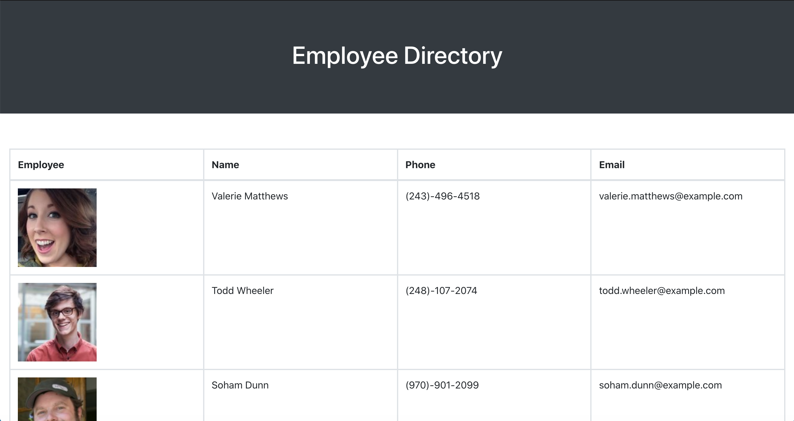

# Employee Directory

  ## Table of Content
  -[Description](#description)
  -[Technologies](#technologies)
  -[Usage](#usage)
  -[DEMO](#demo)

## Description
The following application is an employee directory that lets users view an entire employee directory at once and the ability to have quick access to their information. An employee or manager can benefit greatly from being able to view non-sensitive data about other employees. Users are able to sort the table by name and filter the employees by at least one property.

## Technologies
This application uses the following: React.js, API: randomuser.me.

## Usage
Deployed using github

## Demo

